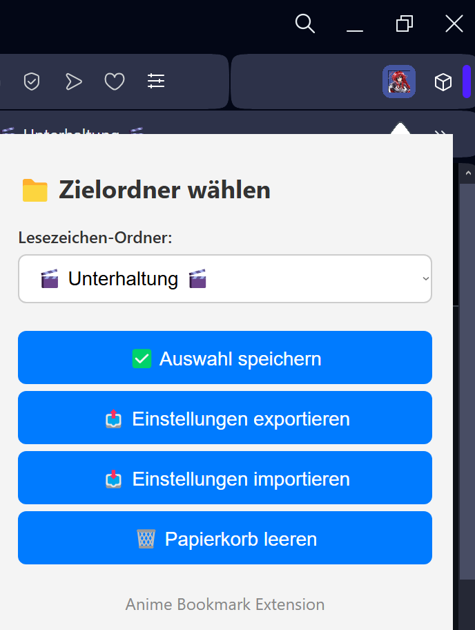
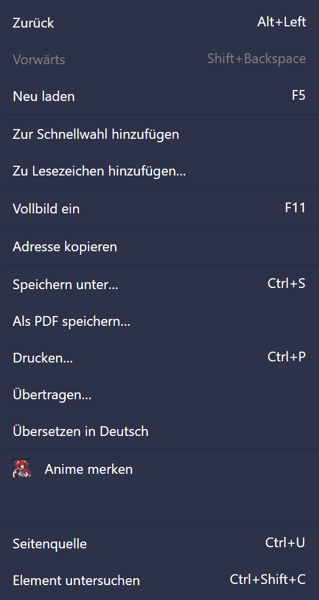

# 📌 Anime Merkliste – Opera/Chrome Erweiterung

Mit dieser Browser-Erweiterung kannst du **Anime-Seiten schnell mit einem Rechtsklick merken**, indem du sie als Lesezeichen speicherst – mit dem aktuell **markierten Text als Titel** und in einem **voreingestellten Ordner** deiner Lesezeichenleiste.

---

## ✨ Funktionen

- 🧠 **Merke Seiten mit Rechtsklick** → Kontextmenüeintrag "Anime merken"
- 🗂️ **Wähle einen Zielordner** in deiner Lesezeichenleiste
- ➕ **Erstelle neue Ordner** direkt aus der Erweiterung
- ❌ **Lösche Ordner**, wenn du sie nicht mehr brauchst
- ✅ **Speichert deine Auswahl dauerhaft** (und optional synchronisiert über `chrome.storage.sync`)
- 📦 Unterstützt **Opera & Chrome**

---

## 🖼️ Screenshots




---

## 🧪 Installation (lokal)

1. Projekt herunterladen oder klonen:

```bash
git clone https://github.com/dein-benutzername/anime-merkliste.git
